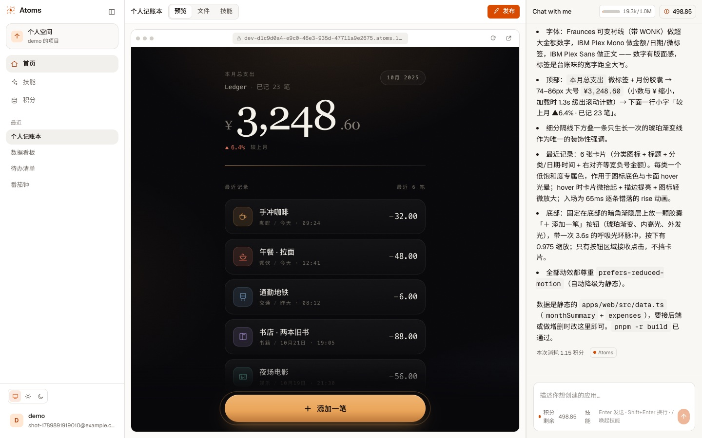
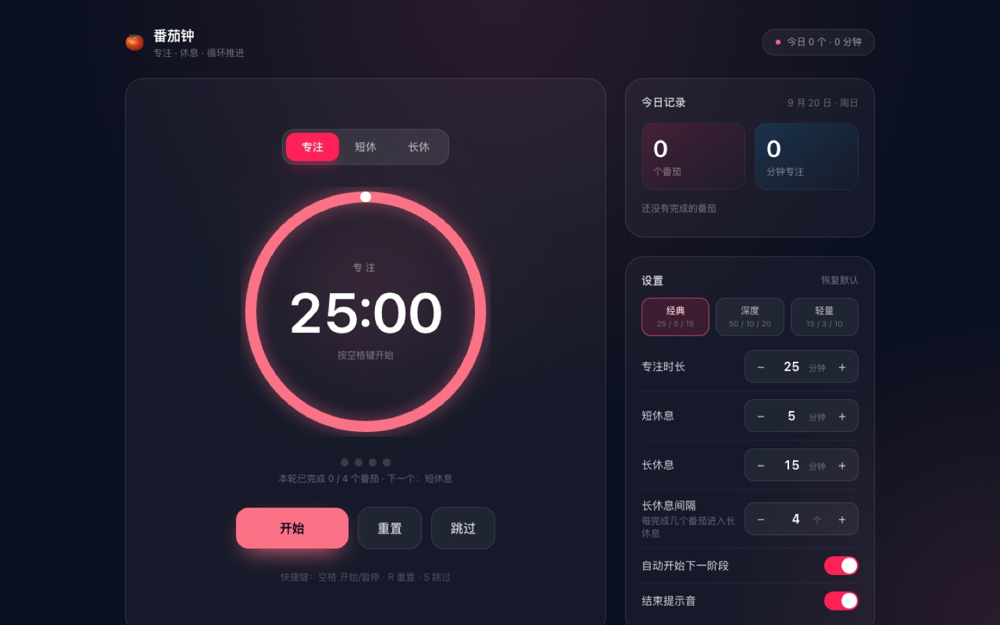
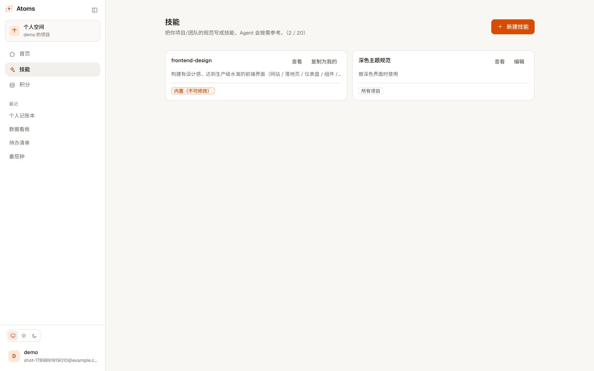
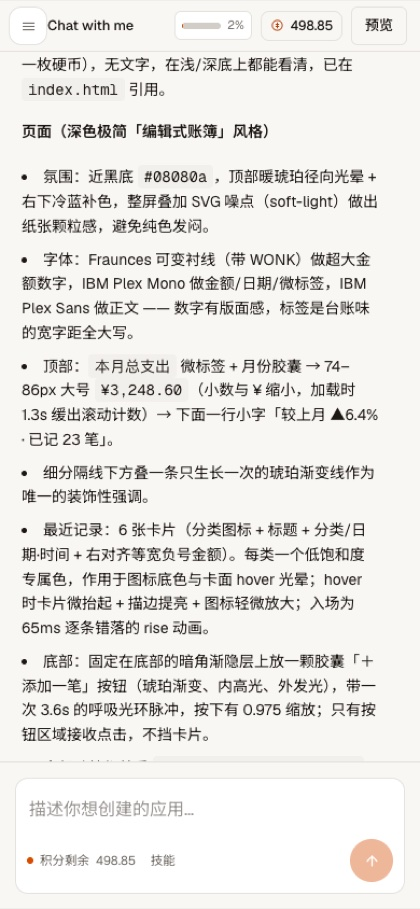

<div align="center">
  <h1 align="center">Another Atoms</h1>

  <p align="center">
    <strong>把一句话变成可运行的全栈应用 —— 沙箱构建、实时预览、一键发布。</strong>
  </p>

  <p align="center">
    灵感来自于 <a href="https://atoms.dev"><strong>Atoms</strong></a>.
  </p>

  <p align="center">
    Built with React 19, Hono, Node 22, Docker Sandbox, and Vercel AI SDK.
  </p>

  <p align="center">
    <a href="https://atoms.lexmin.cn"><strong>在线体验</strong></a> ·
    <a href="#核心特性"><strong>核心特性</strong></a> ·
    <a href="#技术架构"><strong>技术架构</strong></a> ·
    <a href="#功能介绍"><strong>功能介绍</strong></a> ·
    <a href="#未来路线"><strong>未来路线</strong></a> ·
    <a href="#相关文档"><strong>相关文档</strong></a>
  </p>

  <p align="center">
    <a href="./README.md">English</a> | 简体中文
  </p>

  <br/>

  <p align="center">
    <a href="https://github.com/lexmin0412/atoms/actions/workflows/ci.yml">
      
    </a>
    <a href="LICENSE">
      
    </a>
    
    
  </p>
</div>

<br/>



> 线上地址：<https://atoms.lexmin.cn> —— 注册即可使用（每月自动发放额度）。
> 可以试试输入：「做一个番茄钟，深色主题，要有设置面板」

## 核心特性

- **对话式生成**：Agent 通过文件工具与 `run_command` 在沙箱中迭代开发，产出 React/Vite 前端与可选的 Hono 后端
- **真实执行**：`pnpm install`、`pnpm -r build` 都在隔离容器里真实运行，构建结果即预览结果
- **实时预览**：构建产物变化自动刷新 `dev-<id>.<域名>` 子域；含后端时后端容器一并启动并可被前端调用
- **完整工作台**：对话 / 工具卡片 / 命令终端 / 文件树 / 源码编辑（乐观锁）/ 数据库查看（开发·生产）
- **技能系统**：内置技能 + 用户自定义技能，对话中用 `/` 显式唤起或由 Agent 按适用场景自动命中；技能所需的命令行工具由 Agent 在沙箱内按需安装
- **一键发布**：产物托管 + 每应用独立 Postgres schema + 常驻后端容器，发布为 `<id>.<域名>` 的独立应用，可随时下架
- **积分计量**：按 token（区分输入/输出/缓存）计价，每月自动补满，超预算时优雅中断并说明
- **上下文管理**：历史自动裁剪 + 超阈值归纳压缩（只压缩送给模型的部分，会话记录完整保留），并在界面实时显示上下文用量
- **移动端可用**：抽屉导航、单栏工作台切换、安全区与触控适配

## 技术架构

### 架构总览

**控制面与数据面分离，两者不在同一信任域。**

```
A 机（控制面，2C2G）                        B 机（数据面，2C4G）
├─ React SPA（nginx 静态托管）              ├─ 沙箱服务（Hono :4000，仅 127.0.0.1）
├─ Hono BFF（:3010）                        │   └─ Docker：每项目一个隔离容器
│   ├─ Agent 循环（Vercel AI SDK v7）        │       非 root / cap-drop / 内存·CPU·PID 限制
│   ├─ 持有 LLM Key（B 机无任何密钥）        │       出网白名单：DNS/80/443 + A 的数据库端口
│   ├─ Postgres：平台库（源码唯一事实源）    └─ 应用容器：开发预览 / 已发布应用
│   ├─ 应用库：每项目独立 schema + 角色
│   └─ Runtime 适配层 ── SSH 隧道（HMAC）──────┘
```

**关键约束**：控制面**永不执行生成代码**；数据面**不持有任何密钥**——沙箱逃逸也拿不到密钥与平台数据。

### 技术栈

| 层 | 选型 |
|---|---|
| 前端 | React 19 + Vite + TypeScript + Tailwind v4 + AI SDK（`@ai-sdk/react`） |
| 后端 | Hono + Node 22 + Postgres + Vercel AI SDK v7 |
| 模型 | OpenCode Go（`@ai-sdk/openai-compatible`，默认 `deepseek-v4.1-flash`） |
| 沙箱 | Docker（`node:22-bookworm-slim` + pnpm）+ HMAC 鉴权 + SSH 隧道 |
| 部署 | nginx + pm2 + Let's Encrypt + 对象存储（COS，可回退本地目录） |

### 设计取舍

| 取舍 | 选择与理由 |
|---|---|
| 生成物形态 | 固定 pnpm workspace（`apps/web` + 可选 `apps/api`）而非任意工程 —— 让构建 / 预览 / 发布 / 回滚都可预测 |
| 隔离边界 | 控制面与数据面分离 + 每项目独立容器与数据库角色；宁可多一次往返，也不把不可信代码放进控制面 |
| 预览与发布 | 走独立子域（`dev-<id>` / `<id>`）而非同源路径 —— 提前消除跨应用 XSS 与 cookie 作用域问题 |
| 数据事实源 | 源码以平台库为准，沙箱只是执行副本；工作区丢失可从库重建，代价是首次重装依赖（共享 pnpm store 加速） |
| 上下文 | 只裁剪不删除：超阈值时把早期历史归纳为摘要，会话记录保持完整可回看 |

### 目录结构

```
apps/
  api/       # 控制面 BFF：认证、项目、Agent 循环、上下文管理、Runtime 适配层
  web/       # React 工作台（技能管理、数据库查看、文件管理器）
  sandbox/   # 数据面沙箱服务（Docker 编排 + 文件 / 执行 API）
packages/
  shared/    # 共享类型（Runtime 接口、DTO、纯函数）
deploy/
  nginx/     # 站点配置（SSE 不缓冲、安全响应头）
  scripts/   # 运维脚本（数据库备份、隧道巡检）
```

## 功能介绍

### 对话式生成与实时预览


左侧是生成结果的实时预览（构建产物变化自动刷新），可切换到文件树与源码编辑；右侧是对话与工具调用，
右上角实时显示**上下文用量 / 模型窗口**与积分余额。

### 生成出来的应用



上面这个番茄钟是平台生成的产物，一键发布后可直接访问：
<https://88561f03-48bc-4541-9b4f-0301658ebc77.atoms.lexmin.cn>

### 技能系统



内置技能（只读，可查看 / 复制）与用户自定义技能并存；技能里声明的命令行工具会在首次使用时装入沙箱并跨容器复用。

### 移动端

<p align="center"></p>

### 快速上手

**线上**：打开 <https://atoms.lexmin.cn> 注册 → 新建项目 → 输入需求 → 在左侧预览结果 → 点「发布」获得独立链接。

**本地**：

```bash
pnpm install
pnpm -r typecheck && pnpm lint && pnpm fmt:check && pnpm test   # 质量门禁，无需外部依赖

cp .env.example .env      # 填 DATABASE_URL / APP_DATABASE_URL / OPENCODE_GO_API_KEY / SANDBOX_*
pnpm --filter @atoms/api db:init
pnpm dev                  # 同时起 api(:8787) 与 web(:5173)
```

生成 / 预览 / 发布需要一台装有 Docker 的沙箱宿主，部署步骤见
[.agents/skills/atoms-deploy/](./.agents/skills/atoms-deploy/) 与 [docs/architecture.md](./docs/architecture.md)。

## 未来路线

**当前限制**

- 沙箱为 Docker 隔离（未上 gVisor）；出网白名单按 IP / 端口，非域名级
- 并发上限：开发沙箱 4、常驻发布应用 5（池满时回收已空闲沙箱，工作区文件保留）
- 无公网管理台：调额与系统用量查询走命令行（`pnpm --filter @atoms/api credits …`）
- 尚无邮箱验证与找回密码；未接真实计费；无团队协作与代码版本回滚

**优先级**

1. **可观测与稳定性**：请求级链路追踪、错误聚合与告警（当前依赖日志 + 巡检）
2. **生成质量**：需求澄清与阶段化流程（需求 → 计划 → 实现 → 自检门禁），把「构建通过 / 接口可达」作为硬验收
3. **能力扩展**：MCP（外部系统集成，凭据保留在控制面）+ 多 Agent 角色（复用现有提示词装配与技能体系）
4. **隔离升级**：gVisor / Firecracker，出网按域名白名单
5. **协作与运营**：团队空间、真实计费、管理台

## 相关文档

- [docs/architecture.md](./docs/architecture.md)：系统架构（权威来源）
- [docs/operations.md](./docs/operations.md)：运维与稳定性（巡检 / 备份 / 故障排查）
- [docs/security-audit.md](./docs/security-audit.md)：安全审计与修复记录
- [docs/roadmap.md](./docs/roadmap.md)：路线图与里程碑
- [docs/iterations/](./docs/iterations/)：每次迭代的方案与完成情况
- [AGENTS.md](./AGENTS.md)：面向 AI / 协作者的开发约定

License: [MIT](./LICENSE)